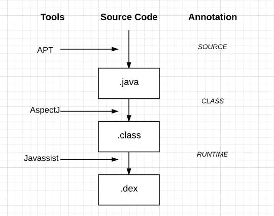

## [目录](#目录)	
1. [android系统四层架构][]
2. [从开机到view被显示出来][]
	1. [系统启动流程][]
	2. [activity启动流程][]
	3. [view绘制流程（测量、布局、绘制）][]
	4. [事件分发流程][]
3. [四大组件][]
	1. [activity][]
	2. [service][]
	3. [broadcastReceiver][]
	4. [contentProvider][]
4. [高级UI][]
	1. [高级绘制(paint、path、canvas、pathMeasure)][]
	2. [自定义view][]
	3. [动画][]
	4. [屏幕适配][]
5. [架构][]
	1. [mvp][]
	2. [mvvm][]
	3. [jetpack][]
	4. [aop三剑客][]
	5. [组件化][]
6. [handler][]
7. [binder][]
8. [jni/ndk][]
9. [相机/OPENGL][]
10. [源码级开发][]
	1. [hook][]
	2. [热修复][]
	3. [插件化][]
	4. [虚拟机][]
	5. [ams][]
	6. [wms][]
	7. [pms][]


[//]: -------------------------------参考式目录跳转连接--------------------------------------------
[android系统四层架构]: #android系统四层架构  
[从开机到view被显示出来]: #从开机到view被显示出来  
[系统启动流程]: #系统启动流程  
[activity启动流程]: #activity启动流程  
[view绘制流程（测量、布局、绘制）]: #view绘制流程  
[事件分发流程]: #事件分发流程  
[四大组件]: #四大组件  
[activity]: #activity  
[service]: #service  
[broadcastReceiver]: #broadcastReceiver  
[contentProvider]: #contentProvider  
[高级UI]: #高级UI  
[高级绘制(paint、path、canvas、pathMeasure)]: #高级绘制  
[自定义view]: #自定义view  
[动画]: #动画  
[屏幕适配]: #屏幕适配  
[架构]: #架构  
[mvp]: #mvp  
[mvvm]: #mvvm  
[jetpack]: #jetpack  
[aop三剑客]: #aop三剑客
[组件化]: #组件化  
[handler]: #handler  
[binder]: #binder  
[jni/ndk]: #jni-ndk  
[相机/OPENGL]: #相机-OPENGL  
[源码级开发]: #源码级开发  
[hook]: #hook  
[热修复]: #热修复  
[插件化]: #插件化  
[虚拟机]: #虚拟机  
[ams]: #ams  
[wms]: #wms  
[pms]: #pms  
[//]: -------------------------------参考式目录跳转连接--------------------------------------------


---------------------------------------------------------------------------------------------------


## android系统四层架构
|   四层架构   |
|    :----:    |
| Application  |
| Framework    |
| Library + VM |
| Linux Kernel |


## 从开机到view被显示出来
### 系统启动流程
1. Boot
	* Book Rom: 开机后引导芯片从固化的ROM里的预设置代码开始执行，然后加载Boot Loader引导程序到RAM
	* Boot Loader: 引导程序检查RAM，初始化硬件参数等
2. 启动Linux内核
3. 启动init进程，它是Linux用户进程
```
AndroidRuntime.cpp:start()
	startJVM()
	ZygoteInit.java:main()
```
4. init进程启动Zygote进程，它是系统第一个Java进程
	* 创建socket
	* 孵化并启动System Server
	* 等待AMS请求
5. Zygote进程孵化出第一个系统进程System Server
	* 启动Binder线程池
	* 创建SystemServiceManager
	* 启动ActivityManagerService、WindowManagerService、PackageManagerService等服务
6. AMS通过socket请求Zygote启动新进程，Zygote创建并启动Launcher应用进程  
	* 请求PMS获取所有安装的应用信息  
	* 在手机屏幕显示应用图标  

> **注意**: Android分为系统进程和应用进程，他们都由Zygote创建。Zygote进程通过复制自身来创建新进程，
他在启动过程中会在内部创建虚拟机VM，每个应用进程都运行在自己的进程中，都有自己独立的VM，每个
VM都是Linux中的一个进程，VM进程、Linux进程、应用进程都可以认为是同一个概念。


#### activity启动流程
**CI: IApplicationThread**(客户端Binder接口)  
**SI: IActivityManager**(服务端Binder接口)  

| 客户端进程                                        | 服务端进程                                 |
| :----                                             | :----                                      | 
| ActivityThread.AppliactionThread extends CI.Stub  | ActivityManagerService extends SI.Stub     |
| 1. startActivity()                                | 3. startActivity()                         | 
| 2. ActivityManager.getService[^1].startActivity() | 4. app.thread[^2].scheduleLaunchActivity() |
| 5. scheduleLaunchActivity()                       | ...                                        |
| 6. Handler.sendMessage(H.LAUNCH_ACTIVITY)         | ...                                        |
| 7. [handleLaunchActivity][]                       | ...                                        |
| 8. [handleResumeActivity][]                       | ...                                        |

[^1]: 等于服务端Binder接口SI，于是调用由客户端进程到服务端进程  
[^2]: 等于客户端Binder接口CI，因此调用从服务端进程回到客户端进程  

#### handlelaunchactivity

`~~~~~~~~~~~~~~~~~~~~~~~~~|-- classLoader(new Activity)`  
`performLaunchActivity -> |-- attach() -> new PhoneWindow`  
`~~~~~~~~~~~~~~~~~~~~~~~~~|-- Instrumentation.callActvityOnCreate()` -> [onCreate][]()  
`~~~~~~~~~~~~~~~~~~~~~~~~~|-- performStart()` -> [onStart][]()  

#### handleresumeactivity

performResumActivity -> onResume()  

`~~~~~~~~~~~~~~~~~~~~~~~~~~~~~|-- -> ViewRootImpl.set(DecorView,l)`  
`~~~~~~~~~~~~~~~~~~~~~~~~~~~~~|-- -> requestLayout`   
`WindownManagerImpl.addView ->|-- -> scheduleTranversals`  
`~~~~~~~~~~~~~~~~~~~~~~~~~~~~~|-- -> postCallback`   
`~~~~~~~~~~~~~~~~~~~~~~~~~~~~~|-- -> doTranversal~~~~~~~~~`|-- [measure][]	    
`~~~~~~~~~~~~~~~~~~~~~~~~~~~~~|-- -> performTranversals ->`|-- [layout][]	    
`~~~~~~~~~~~~~~~~~~~~~~~~~~~~~~~~~~~~~~~~~~~~~~~~~~~~~~~~~`|-- [draw][]	  

```
等价于:  
`~~~~~~~~~~~~~~~~~~~~~~~~~~~~~~~~~~~~~~~~~~~~~~~~~~~~~~~~~~~~~~~~~~~~~~~~~~~~~~~~~~~~~~~~~~~~~~~~~~~~~~~~~~~~~~~~~~~~~~~~~~~~~~~~~~~~~~~~~~~~~~~~~~~~~~~~~~~~~~`|-- [mesure][]
`WindownManagerImpl.addView -> ViewRootImpl.set(DecorView,l) -> requestLayout -> scheduleTranversals ->  postCallback -> doTranversal -> performTranversals -> `|-- [layout][]
`~~~~~~~~~~~~~~~~~~~~~~~~~~~~~~~~~~~~~~~~~~~~~~~~~~~~~~~~~~~~~~~~~~~~~~~~~~~~~~~~~~~~~~~~~~~~~~~~~~~~~~~~~~~~~~~~~~~~~~~~~~~~~~~~~~~~~~~~~~~~~~~~~~~~~~~~~~~~~~`|-- [draw][]
```

### view绘制流程
#### oncreate
```
DecorView(继承FrameLayout)  
|--------------------|  
|    LinearLayout    |  
| |----------------| | 
| | |------------| | |  
| | |    tab     | | | tab: 标题栏
| | |------------| | |  
| |                | |  
| | |------------| | |  
| | |            | | |  
| | |  content   | | | content: 内容栏，继承FrameLayout, Id = R.android.content  
| | |            | | |  
| | |            | | |  
| | |------------| | |  
| |----------------| |                      
|--------------------|  
```

```
setContentView(layoutResId)
	getWindow.setContentView
		installDecorView                    //创建DecorView,并找到id为R.android.content的容器
			mContentParent = findViewById(R.android.content)
		inflate(layoutResId,mContentParnet) //解析xml布局，并将其设置到容器mContentParent中
```

**MeasureSpec**: 32为int值
* 高2位表示specMode
	* UNSPECIFIED: 父容器不对view限制，系统用
	* EXACTLY: match_parent、固定大小
	* ATU_MOST: wrap_content
* 后30位表示specSize

#### measure


#### layout
```
(DecoView,params,width,height)         setFrame: 取定自身top, left, right, bottom
PerformLayout ---------------> layout  onlayout -> layoutChildren 遍历for { layout }
                                         ↑                                    ↓
                                         ↑ -----← -----setFrame-----← --------↓
```

#### draw
```
PerformDraw -> draw -> drawSoftware -> draw
	drawBackground: 绘制背景
	onDraw: 绘制自己,如果时ViewGroup其实什么也没做，因为最终会调用View的onDraw,这是个空方法
	dispatch -> 遍历for { drawChild -> draw } -> drawBackground ...
	onDrawForeground: 绘制前景，流动条、装饰等
```

### 事件分发流程


[handleLaunchActivity]: #handlelaunchactivity
[handleResumeActivity]: #handleresumeactivity
[onCreate]: #oncreate
[onStart]: #onstart
[measure]: #measure
[layout]: #layout
[draw]: #draw


## 四大组件
...

## 高级UI
### 自定义view ([demo-巅峰之作](https://github.com/wonderful27x/CustomGridView)) ([demo2-巅峰之作](https://github.com/wonderful27x/CustomCamera))
...


## 架构
### aop三剑客

> aop是一种面向切面的编程思想，从一系列纵向的业务中抽离出共同的部分在横向上形成一个切面，  
集中处理这些共同的部分



#### AspectJ ([demo-巅峰之作](https://github.com/wonderful27x/AopDemo))
#### APT ([demo-巅峰之作](https://github.com/wonderful27x/AopDemo))
#### Javassist

### 组件化 ([demo](https://github.com/wonderful27x/ComponentProject))
...


## handler
**ThreadLocal**: 通过ThreadLocal对象可以在不同的线程中存取数据, 原理如下 
* ThreadLocalMap: 内部类，类似于map，以key-value的形式存取数据
* set(): 获取当前线程中的ThreadLocalMap对象，以ThreadLocal.this作为key存储数据
* get(): 获取当前线程中的ThreadLocalMap对象，以ThreadLocal.this作为key获取数据

> 注: Thread线程中持有一个ThreadLocal.ThreadLocalMap的对象threadLocals

**MessageQueue**: 消息队列,Handler发送的消息先存入队列

**Looper**: 消息循环器，循环从MessageQueue中取出消息，并进行消息分发处理
* static ThreadLocal sThreadLocal: 静态ThreadLocal对象
* MessageQueue mQueue: 消息队列
* prepare(): sThreadLocal.set(new Looper()),创建Looper并使用ThreadLocal存储到当前线程
* myLooper(): sThreadLocal.get(),通过ThreadLocal获取当前线程存储的Looper
* loop(): msg = myLooper().mQueue.next() -> msg.target.dispatchMessage(msg), 获取当前线程Looper中的消息队列，并循环取出message然后进行分发处理

**Handler**: 消息发送者、管理者、处理者 
* Handler(): 构造函数
	* mLooper = Looper.myLooper: 获取Looper引用，如果当前线程没有则抛出异常
	* mQueue = Looper.mQueue: 获取消息队列引用 
* handleMessage(Message msg): 消息方法
* Callback mCallback: 消息处理接口
* dispatchMessage(Message msg): 消息分发
	* 先执行Message中的callback
	* 再执行Handler的callback
	* 最后执行Handler的handlerMessage

使用流程
1. 创建Looper: Looper.prepare()
2. 创建Handler: new Handler()
3. 启动Looper: Looper.loop()

> 注意: 
> 1. 如果是主线程不需要自己创建Looper，因为Android已经为主线程创建了Looper
> 2. 子线程必须创建Looper，否则Handler抛出异常
> 3. MessageQueue是阻塞队列，子线程创建的Lopper必须安全退出，否则队列将一直循环


## binder
**Binder**
* transact(): 发起远程调用，运行在客户端，客户端线程挂起
* onTransact(); 远程调用响应，运行在服务端Binder线程池

**AIDL**: android接口定义语言，简化进程间(IPC)通信双方的接口定义
1. 创建.aidl接口文件
2. 实现Stub内部抽象类
3. 从Service的onBind方法返回Stub给客户端

**Binder调用流程**
1. client发起远程方法调用
2. Binder
	1. 创建输入对象Parcle \_data
	2. 创建输出对象Parcle \_rely
	3. 创建返回值对象\_result
	4. 将参数打包到\_data中
	5. 调用transact，同时挂起客户端线程
3. 通过native将数据发送到内核空间(不同的进程可以通过内核空间共享内存)
4. Service端onTransact被调用
	1. 从\_data中取出参数
	2. 执行目标方法
	3. 将返回值写入\_rely
5. 通过native将返回值发送到内核空间
6. 从\_rely中取出返回值赋给\_result
7. 唤醒客户端线程，返回\_result


## jni-ndk
**jni**: java本地接口，java和C/C++交互的桥梁
* 正向调用: java -> C/C++
	* 字符串匹配: java_包名_类名_方法名
	* 关联表: JniNativeMethod {方法名(java)，方法签名(参数返回值描述)，函数指针(c)}
		* 方法名和方法签名以及class信息唯一确定了java方法，函数指针则对应C方法，形成映射关系
		* Jni_OnLoad: so加载时调用，在这里注册JniNativeMethod
		* Jni_OnUnload: so卸载时调用，在这里注销JniNativeMthoed
* 反向调用: C/C++ -> java
	* 获取jclass: GetObjectClass/FindClass
	* 获取jfieldID: GetFieldID(jclass,字段名,类型签名)
	* 获取jmethodID: GetMethodID(jclass,方法名,方法签名)
	* 调用方法: CallVoidMethod(jobject,jmethodID，参数)


## 相机-OPENGL
* SurfaceView: 不是普通的view,它有自己的surface，子线程更新
* GLSurfaceView: 继承自SurfaceView,提供了EGL环境，可用于opengl渲染
* SurfaceTexture: 可将图像转成纹理
* TextTureView: 继承自普通View，可以用于显示纹理

**opengl渲染相机画面**([demo](https://github.com/wonderful27x/OpenGlCameraRender))
1. 实现GLSurfaceView的Render接口
2. GLSurfaceView.onCreate中创建纹理和SurfaceTexture,并将纹理绑定到SurfaceTexture
3. 将SurfaceTexture设置给Camera
4. Camera捕获数据后回调SurfaceTexture.onFrameAvailable
5. 调用GLSurfaceView.requestRender请求渲染
6. GLSurfaceView.onDrawFrame被调用，update更新纹理到opengl
7. 调用opengl绘制纹理

**Camera2**([demo-巅峰之作](https://github.com/wonderful27x/CameraCapture))
1. 获取CameraManager: getSystemService(Context.CAMERA_SERVICE)
2. 获取CameraId: CameraManager.getCameraIdList()
3. 打开相机CameraManager.openCamera，并获取CameraDevice
4. 创建CameraCaptureSession: CameraDevice.createCaptureSession
5. 创建CaptureRequest: CameraDevice.createCaptureRequest,并设置数据接收者ImageReader/Surface
6. 发送拍照请求: CameraCaptureSession.capture(CaptureRequest)

**Camera1**([demo](https://github.com/wonderful27x/CustomCamera))  

## 源码级开发
...
