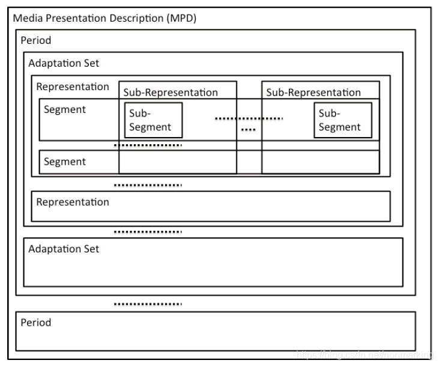

# MPEG-DASH
> MPEG-DASH全称Dynamic Adaptive Streaming over HTTP, 是一种自适应比特率流媒体技术。  
MPEG-DASH类似HLS, 不同的是HLS使用ts作为分片, MPEG-DASH推荐使用fmp4。并且MPEG-DASH与编码无关。  

## FMP4
> fmp4类似mp4, 它由一系列segments(moof+mdat)组成, 这些segments可以被独立的request(利用byte-range),  
这样有利于在不同质量级别的码流之间切换, 下面展示了它与mp4的差异

* refular mp4
```
[ftyp] size=8+16
[moov] size=8+9149
[mdat] size=8+17923439
```

* fmp4
```
[ftyp] size=8+28
[moov] size=8+790
[sidx] size=12+368
[moof] size=8+1304
[mdat] size=8+2447381
[moof] size=8+132
[mdat] size=8+164418
[moof] size=8+1304
[mdat] size=8+2612620
[moof] size=8+132
[mdat] size=8+124621
```
> sidx(segment index) box, 它记录了各个moof+mdat组成的segment的精确byte position，  
所以我们只需要Load一个很小的sidx box就能方便的实现码率切换了

## [MPD](https://cxyzjd.com/article/nonmarking/85714099 "原作者zhanghui_cuc")
> mpd类似hls中的m3u8文件，用于描述MPEG-DASH的分片信息, mpd使用xml格式。


* **媒体时段（Period）**: 在MPEG-DASH中将一组不同编码参数的媒体内容和相应的描述集合定义为媒体展示（presentation）。  
这里的媒体内容是由单个或多个时间上连续的媒体时段（period）组成的，这些媒体时段的内容相互之间可能完全独立，例如在正片中插入的广告内容。  
一个媒体时段内可用媒体内容的编码版本不会变更，即可选的码率集合、语言集合、字幕集合不会再改变。

* **自适应集合（Adaptation Set）**: 一个媒体时段由一个或者多个自适应集合组成，每一个自适应集合对应一个媒体内容组件，如音频、视频或字幕。

* **媒体文件描述（Representation）**: 每个自适应集合由一个或多个媒体文件描述构成，每个媒体文件描述对应一个可独立解码播放的媒体流。  
MPEG-DASH中的自适应切换就是根据网络环境或其他因素在同一个自适应集合的不同媒体文件描述之间进行切换。媒体文件描述是MPD中最小的抽象集合概念。

* **切片（Segment）**: 每个媒体文件描述由一个或多个一定时长的切片组成，每个切片都对应各自的URL，或对应同一URL的不同字节范围（byte range）。  
在MPEG-DASH中，一个切片就对应一次HTTP请求可以取回的最大数据单元。

* **一个复杂的mpd示例**: 
```
<!--profiles:不同的profile对应不同的MPD要求和Segment格式要求
mediaPresentationDuration:整个节目的时长
minBufferTime:至少需要缓冲的时间
type:点播对应static，直播对应dynamic
availabilityStartTime="2016-06-28T08:16:57Z":如果是直播流的话,则必须提供,代表MPD中所有Seg从该时间开始可以request了
minimumUpdatePeriod="PT10H":至少每隔这么长时间,MPD就有可能更新一次,只用于直播流-->
<MPD xmlns="urn:mpeg:DASH:schema:MPD:2011" xmlns:ytdrm="http://youtube.com/ytdrm" mediaPresentationDuration="PT0H3M1.63S" minBufferTime="PT1.5S" profiles="urn:mpeg:dash:profile:isoff-on-demand:2011"
type="static">
  <!-- Ad content-->
  <!--duration:Period的时长;start:Period的开始时间-->
  <Period duration="PT30S" start="PT0S">
     <!--BaseURL:相当于根目录,该元素可以在MPD\Period\AdaptationSet\Representation同时出现,若同时出现,则层层嵌套;
     在每一层也可以出现多次,默认使用第一个BaseURL-->
     <BaseURL>ad/</BaseURL>
     <!-- 广告部分的内容可以在720p和1080p之间切换,分别对应两个representation,这两个representation组成一个AdaptationSet;
	几个rep如果要组成一个AS,它们的lang(语言)\contentType\par(宽高比)必须相同;
	segmentAlignment:如果为true,则代表该AS中的segment互不重叠
	startWithSAP:每个Segment的第一帧都是关键帧-->
     <AdaptationSet mimeType="video/mp4" minWidth="1280" par="16:9" contentType="video" maxWidth="1920" minHeight="720" segmentAlignment="true" startWithSAP="1" maxHeight="1080">
         <!-- 720p Representation at 3.2 Mbps;在Representation 层可能出现和AS层重复的属性,以最内层的定义为准-->
         <Representation id="AD720p" bandwidth="3200000" width="1280" height="720" codecs="avc1.640028" mimeType="video/mp4">
             <!--第一种Segment组织形式:BaseURL+SegmentBase;
		适用于每个rep只有一个Seg的情况,往往配合Initialization指定seg初始化信息的byte-range以及indexRange指定Segment index的byterange;
		对于ISO base媒体格式,Initialization部分即对应ftyp+moov这两个box的内容,不能包含任何moof的内容,moov中不能包含media data.关于这些box的含义参见本系列第二篇文章和14496标准;
		对于ISO base媒体格式,Segment Index部分即对应sidx box的内容.标准规定一个Seg又可以切分为多个SubSeg,对应整个Seg的一部分数据,用Segment Index来描述,
		同时,SubSeg还可以进一步切分,即嵌套. 
		sidx box在文件的头部位置,client可以先读取这部分数据,后续就可以只用partial request的方法请求需要的信息,而不用获取全部信息,
		这样的设计主要是为了Seek的方便.实际上通常一个SubSeg就对应一个moof+mdat的内容.
		一个实际的sidx参见本系列第二篇文章和14496标准;
		因为上一个BaseURL的存在,在本示例中的range都对应xxxx.com/ad/720p.mp4这个文件 -->
             <BaseURL>720p.mp4</BaseURL>
             <SegmentBase indexRange="2789-3264">
          	<Initialization range="0-2788" />
             </SegmentBase>
         </Representation>
         <!-- 1080p Representation at 6.8 Mbps -->
         <Representation id="AD1080p" bandwidth="6800000" width="1920" height="1080" codecs="avc1.640028" mimeType="video/mp4">
             <BaseURL>1080p.mp4</BaseURL>
             <SegmentBase indexRange="2755-3230">
          	<Initialization range="0-2754" />
             </SegmentBase>
         </Representation>
     </AdaptationSet>
  </Period>
  <!-- Normal Content -->
  <!--这个Period的开始时间=上一个Period的start+duration-->
  <Period duration="PT0H3M1.63S">
    <!--正片部分的第一个AdaptationSet ,由不同视频码率\分辨率的几个Rep组成-->
    <AdaptationSet mimeType="video/mp4" minWidth="1280" par="16:9" contentType="video" maxWidth="1920" minHeight="720" segmentAlignment="true" startWithSAP="1" maxHeight="1080">
      <!--对AS中媒体内容类型的描述-->	
      <ContentComponent contentType="video" id="1" />
      <!--ContentProtection元素提供了与DRM有关的信息,多个ContentProtection元素即代表当前的DASH内容支持多种DRM方案;
	schemeIdUri属性的内容对应所用DRM方案的uuid值,为了让多种DRM方案可以解密相同的文件,一般都遵循通用加密标准,即CENC,
	在DASH标准中规定cenc对应的schemeIdUri是urn:mpeg:dash:mp4protection:2011,在指明了cenc之后,可以再利用CP元素指定其他的DRM方案,
	具体的uuid-DRM方案对应列表参见http://dashif.org/identifiers/protection/，示例中的edef8ba9-79d6-4ace-a3c8-27dcd51d21ed对应的就是Widevine方案;
	value属性的内容一般是为对应DRM方案提供补充信息的,标准中规定了CENC对应的value值,即schm(scheme type)box中对应的值:cenc. 
	对于其他的DRM方案,它们的一些初始信息一般放在cenc:pssh元素中,其内容对应pssh(protection scheme specific header) box中内容,
	这些信息是BASE64编码的,示例中的内容解码后就可以看到实际包含了contentID和providerID的信息(在本示例中是2015_tears*AUDIO和widevine_test).
	如果是Playready方案,这个pssh中还可能包含了license server的url信息,至于Widevine方案,包括ExoPlayer在内的很多实现都是把license server的url写死在播放器的实现里面的,显然这是一个需要自己做扩展的地方.
	解密内容需要的KID定义在tenc(track encryption) box中,IV定义在senc(Sample Encryption) box中,同时cenc规定的加密算法是AES-CTR,至此,一个DRM系统需要的各种信息基本都有了;
	上面提到的cenc相关内容参见23001-7标准;-->
      <ContentProtection value="cenc" schemeIdUri="urn:mpeg:dash:mp4protection:2011" cenc:default_KID="7862029a-3d0d-58ea-a4f6-5bdf308646a9"/>
      <ContentProtection schemeIdUri="urn:uuid:edef8ba9-79d6-4ace-a3c8-27dcd51d21ed">
	<cenc:pssh>
		AAAAR3Bzc2gAAAAA7e+LqXnWSs6jyCfc1R0h7QAAACcIARIBMBoNd2lkZXZpbmVfdGVzdCIKMjAxNV90ZWFycyoFQVVESU8=	
	</cenc:pssh>
      </ContentProtection>
      <Representation bandwidth="4190760" codecs="avc1.4d401f" height="1080" id="1" mimeType="video/mp4" width="1920">
	<!--这次只在Representation 层有BaseURL,于是所有的range都对应xxxx.com/car-cenc-20120827-89.mp4这个文件-->
        <BaseURL>car_cenc-20120827-89.mp4</BaseURL>
        <SegmentBase indexRange="2755-3230">
          <Initialization range="0-2754" />
        </SegmentBase>
      </Representation>
      <Representation bandwidth="2073921" codecs="avc1.4d401f" height="720" id="2" mimeType="video/mp4" width="1280">
	<!--第二种Segment组织形式:(BaseURL)+SegmentList.SegmentList很好理解,就是一个SegmentURL的列表,每一个URL就对应一个可request的Segment;
	    必须指定duration:每个Seg的时长(s);
	    这里指定了一个BaseURL,则每一个SegmentURL实际对应的是xxxx.com/SegmentListExample/segment-1.m4s-->
	<BaseURL>SegmentListExample/</BaseURL>
	<SegmentList duration="2">
	   <!--这里也有一个Initialization元素,它的实际内容也是ftyp+moov-->
           <Initialization sourceURL="car_cenc-20120827-88.mp4"/>
	   <!--每一个SegmentURL对应的media content往往就是sidx+moof+mdat;
		由此我们可以理解这种Seg组织形式与第一种是类似的,只不过把每一个抽象的SubSeg具体的表达出来;
		对于每一个Seg的格式,标准中也有一些要求:每个segment可以包含一个styp box,如果包含了,应该有msdh和msix brand;
		应该包含一个或多个moof+mdat的组合;可以包含一个或多个sidx,需要放在moof之前-->
           <SegmentURL media="segment-1.m4s"/>
           <SegmentURL media="segment-2.m4s"/>
           <SegmentURL media="segment-3.m4s"/>
           <SegmentURL media="segment-4.m4s"/>
           <SegmentURL media="segment-5.m4s"/>
           <SegmentURL media="segment-6.m4s"/>
           <SegmentURL media="segment-7.m4s"/>
           <SegmentURL media="segment-8.m4s"/>
           <SegmentURL media="segment-9.m4s"/>
           <SegmentURL media="segment-10.m4s"/>
        </SegmentList>
      </Representation>
    </AdaptationSet>
    <!--正片部分的第二个AdaptationSet ,由音频Representation 组成,它们的语言都是英语-->
    <AdaptationSet mimeType="audio/mp4" lang="en" startWithSAP="1" contentType="audio" segmentAlignment="true">
      <ContentComponent contentType="audio" id="2" />
      <Representation bandwidth="255236" codecs="mp4a.67.02" id="3" mimeType="audio/mp4" audioSamplingRate="44100" startWithSAP="1">
	<!--声道数,在value中指明-->
	<AudioChannelConfiguration schemeIdUri="urn:mpeg:dash:23003:3:audio_channel_configuration:2011" value="2"/>
	<!--第三种Segment组织形式:(BaseURL)+SegmentTemplate+SegmentTimeline;
	SegmentTemplate同样可以指定init信息,它的内容依然是ftyp+moov;
	media指定用来生成Segment列表的模板,可以包含的通配符有$RepresentationID$\$Bandwidth$\$Number$\$Time$,
	Number对应Seg的序号,Time对应Seg的起始时间.Time和Number只能取其一.-->
        <SegmentTemplate initialization="audio/en/init.mp4" media="audio/en/seg-$Number$.m4f" startNumber="1" timescale="90000">
	     <!--SegmentTimeline的作用是帮助client知道服务器端有多少个Segment;
		一个SegmentTimeline元素有多个S元素组成,每个S元素包含三个属性:@t(start time)\@r(repeat count)\@d(duration)
		这里的示例表示从时间0开始,有10个Seg,每个Seg的duration是5400000/90000(sec);
		最后得到的实际Seg URL就是xxx.com/audio/en/seg-1.m4f-->
	     <SegmentTimeline>
		<S t="0" r="10" d="5400000"/>
	     </SegmentTimeline>
	</SegmentTemplate>
      </Representation>
      <Representation bandwidth="31749" codecs="mp4a.67.02" id="4" mimeType="audio/mp4" audioSamplingRate="22050" startWithSAP="1">
        <BaseURL>car_cenc-20120827-8b.mp4</BaseURL>
        <SegmentBase indexRange="2673-2932">
          <Initialization range="0-2672" />
        </SegmentBase>
      </Representation>
    </AdaptationSet>
    <!--正片部分的第三个AdaptationSet,也是由音频Representation 组成,但是它们的语言是法语-->
    <AdaptationSet lang="fr" mimeType="audio/mp4" contentType="audio" segmentAlignment="true" startWithSAP="1">
	<AudioChannelConfiguration schemeIdUri="urn:mpeg:dash:23003:3:audio_channel_configuration:2011" value="2"/>
	<!--第三种Seg组织形式的变体:(BaseURL)+SegmentTemplate+duration-->
	<!--因为init信息不包含实际的媒体内容,所以duration为0-->
	<SegmentTemplate initialization="audio/fr_init.mp4" duration="0"/>
	<Representation id="5" mimeType="audio/mp4" codecs="mp4a.67.02" audioSamplingRate="48000" startWithSAP="1" bandwidth="63008">
		<!--与前一种形式不同,这里没有具体指定每个Seg的duration,而只有一个duration值,
		这个值可能是不精确的,这也是不使用SegmentTimeline的一大劣势.duration(sec)=duration/timescale-->		
		<SegmentTemplate timescale="1000" duration="9941" media="audio/64kbps/redbull_audio_64kbps_segment$Number$.m4s" startNumber="1"/>
	</Representation>
    </AdaptationSet>
  </Period>
</MPD>
```
